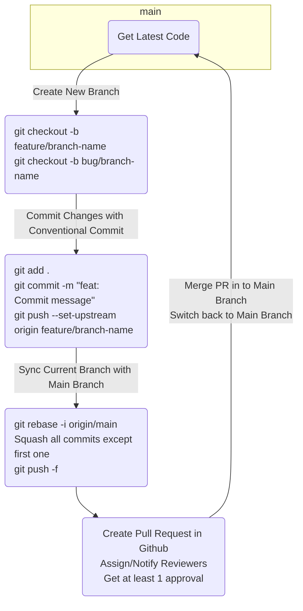

> [!WARNING] 
> THIS REPO IS CURRENTLY UNDER CONSTRUCTION.

# bankai-ui
A flexible UI SDK to serve as a solid starting point when establishing dev standards, enforcing code quality and establishing design systems.

**Key Features**

- Components with minimal defaults that can easily be customized.
- Focus on accessibility, semantics and responsiveness.
- Theming System and Design Tokens that can be customized for any application.
- Interactive Design System that utilizes Storybook to provide component demos, usage recommendations and design specifications.
- Libraries for dealing with Color, Date and Time, SASS utilities, etc.
- Customizable set of default Linting for JavaScript, React, SASS/CSS and accessibility.
- Standard set of unit test utilities and libraries built on React Test Utils and Jest.

## Prerequisites
You should have the following installed on your machine before starting:

-   Node and NPM (managed through Node Version Manager (NVM))
    -   [NVM for Mac](https://github.com/nvm-sh/nvm)
    -   [NVM for Windows](https://github.com/coreybutler/nvm-windows)

Also, make sure to [install `Lerna` globally on your machine](https://lerna.js.org/#getting-started).

## Symlinking Packages for Local Development
To use the packages from this project locally in other projects:

1. Clone this repo to the same location as the other project so they are siblings in the same parent folder.
1. In this project's root `package.json` find `symlink:packages` in the `scripts` section and add the name of the folder for your other project at the end. (Ex: `"symlink:packages": "node ./scripts/symlinkPackages.js my-other-project"`)
1. In terminal run the `symlink:packages` from the root of this project.

This should create symlinks to all the packages in this repo for your other package to start using.

### Unlinking Packages
To unlink this repo's packages from your other projects:

1. Ensure you have modified the `symlink:packages` script as described in the above steps.
1. In terminal run the `symlink:remove:packages` from the root of this project.

> **Note** 
> Make sure to revert the changes you made to the `symlink:packages` before committing your code!

## Running Storybook
1. Clone this repo to the desired location on your machine and navigate to the root of the project within your terminal.
1. Run `lerna bootstrap` to install all dependencies.
1. Navigate to `packages/storybook`.
1. Run `npm start` in your terminal to start up Storybook.

> **Note**
> If you run in to an error when running `lerna bootstrap` in regard to peerDependencies and you're on the latest version of node/npm, run `npm config set legacy-peer-deps true` to fix. This prevents npm from trying to auto-install peer dependencies by default.

## Running Tests
The following should all be run from the project root folder:

**Run All Tests**
```
npm run test
```

**Get Coverage For All Tests**
```
npm run test -- --coverage
```

**Watch**

Run tests and automatically update results when changes are made to corresponding code.
```
npm run test -- --watch
```

**Run a Specific Test**
```
npm run test packages/components/buttons/src/__tests__/Button.test.jsx
```

**Run All Tests in a Package**
```
npm run test packages/components/buttons/src/**/*.jsx
```

**Get Coverage For All Tests in a Package**
```
npm run test packages/components/buttons/src/**/*.jsx -- --coverage --collectCoverageFrom="packages/components/buttons/src/**/*.jsx"
```

## Developer Workflow



> **Note**
> When committing code make sure to use [Conventional Commits](https://www.conventionalcommits.org/en/v1.0.0/). This automates the versioning of packages and updating of CHANGELOGs.

## The Tech Stack
- [Lerna](https://lerna.js.org/)
- [React](https://reactjs.org/)
- [SASS](https://sass-lang.com/)
- [ESLint](https://eslint.org/)
- [StyleLint](https://stylelint.io/)
- [Prettier](https://prettier.io/)
- [Jest](https://jestjs.io/docs/en/getting-started)
- [React Testing Library](https://testing-library.com/docs/react-testing-library/intro/)