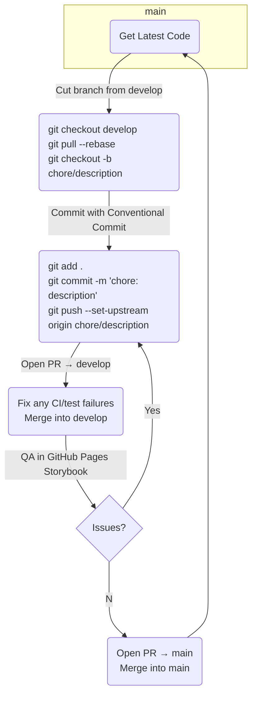

> [!WARNING] 
> THIS REPO IS CURRENTLY UNDER CONSTRUCTION.

# bankai-ui
A flexible UI SDK to serve as a solid starting point when establishing dev standards, enforcing code quality and establishing design systems.

**Key Features**

- Components with minimal defaults that can easily be customized.
- Focus on accessibility, semantics and responsiveness.
- Theming System and Design Tokens that can be customized for any application.
- Interactive Design System that utilizes Storybook to provide component demos, usage recommendations and design specifications.
- Libraries for dealing with Color, Date and Time, SASS utilities, etc.
- Customizable set of default Linting for JavaScript, React, SASS/CSS and accessibility.
- Standard set of unit test utilities and libraries built on React Test Utils and Jest.

## Prerequisites
You should have the following installed on your machine before starting:

-   Node and NPM (managed through Node Version Manager (NVM))
    -   [NVM for Mac](https://github.com/nvm-sh/nvm)
    -   [NVM for Windows](https://github.com/coreybutler/nvm-windows)

Also, make sure to [install `Lerna` globally on your machine](https://lerna.js.org/#getting-started).

## Symlinking Packages for Local Development
To use the packages from this project locally in other projects:

1. Clone this repo to the same location as the other project so they are siblings in the same parent folder.
1. In this project's root `package.json` find `symlink:packages` in the `scripts` section and add the name of the folder for your other project at the end. (Ex: `"symlink:packages": "node ./scripts/symlinkPackages.js my-other-project"`)
1. In terminal run the `symlink:packages` from the root of this project.

This should create symlinks to all the packages in this repo for your other package to start using.

### Unlinking Packages
To unlink this repo's packages from your other projects:

1. Ensure you have modified the `symlink:packages` script as described in the above steps.
1. In terminal run the `symlink:remove:packages` from the root of this project.

> **Note** 
> Make sure to revert the changes you made to the `symlink:packages` before committing your code!

## Running Storybook
1. Clone this repo to the desired location on your machine and navigate to the root of the project within your terminal.
1. Run `lerna bootstrap` to install all dependencies.
1. Navigate to `packages/storybook`.
1. Run `npm start` in your terminal to start up Storybook.

> **Note**
> If you run in to an error when running `lerna bootstrap` in regard to peerDependencies and you're on the latest version of node/npm, run `npm config set legacy-peer-deps true` to fix. This prevents npm from trying to auto-install peer dependencies by default.

## Running Tests
The following should all be run from the project root folder:

**Run All Tests**
```
npm run test
```

**Get Coverage For All Tests**
```
npm run test -- --coverage
```

**Watch**

Run tests and automatically update results when changes are made to corresponding code.
```
npm run test -- --watch
```

**Run a Specific Test**
```
npm run test packages/components/buttons/src/__tests__/Button.test.jsx
```

**Run All Tests in a Package**
```
npm run test packages/components/buttons/src/**/*.jsx
```

**Get Coverage For All Tests in a Package**
```
npm run test packages/components/buttons/src/**/*.jsx -- --coverage --collectCoverageFrom="packages/components/buttons/src/**/*.jsx"
```

## Developer Workflow

### Branch Naming

Use a prefix that matches the primary intent of the work followed by a short description.

| Prefix | When to use |
|--------|-------------|
| `feature/` | New functionality |
| `bug/` | Bug fixes |
| `chore/` | Maintenance, upgrades, refactoring, tooling |
| `docs/` | Documentation only |

Format: `prefix/short-description`

Examples:
```
feature/eslint-flat-config
bug/storybook-a11y
chore/proptypes-removal
docs/readme-cleanup
```

### Commit Messages

This repo uses [Conventional Commits](https://www.conventionalcommits.org/en/v1.0.0/) enforced via commitlint. Non-conforming commits will be rejected.

Format: `type: short description`

| Type | When to use |
|------|-------------|
| `feat` | Adding or modifying a feature |
| `fix` | Bug fix |
| `chore` | Maintenance, upgrades, refactoring, tooling — no production code change |
| `docs` | Documentation only |
| `style` | Formatting, whitespace — no logic change |
| `test` | Adding or updating tests |
| `ci` | CI/CD configuration changes |
| `revert` | Reverting a previous commit |

**When a commit touches multiple types**, use the type that reflects the primary intent. If the docs update is part of the same effort as the feature, commit them together as `feat`.

**Breaking changes** — use `!` after the type and a `BREAKING CHANGE:` footer:

```
feat!: remove prop-types from all components

BREAKING CHANGE: prop-types is no longer a peer dependency. Remove
prop-types from your project if it was only required by bankai-ui.
```

**Linking to GitHub issues** — use `Closes` in the commit footer to auto-close issues on merge:

```
chore: eslint migration

Closes #123
Closes #124
```

### Branch Flow

```
main (production)
  ↑
develop (staging — auto-deploys to GitHub Pages for QA)
  ↑
chore/your-branch (your working branch)
```

1. Cut a new branch from `develop` for each piece of work
2. Do your work, committing with conventional commits
3. Open a PR from your branch → `develop`
4. Fix any CI failures or test issues
5. Merge into `develop` — Storybook deploys automatically for QA
6. Once satisfied, open a PR from `develop` → `main`
7. Merge into `main`


```mermaid
flowchart TD
    subgraph main
    nodeStart(Get Latest Code)
    end
    nodeStart --Cut branch from develop--> newBranchStart("git checkout develop\ngit pull --rebase\ngit checkout -b chore/description")
    newBranchStart --Commit with Conventional Commit--> newBranchCommit("git add .\ngit commit -m 'chore: description'\ngit push --set-upstream origin chore/description")
    newBranchCommit --Open PR → develop--> prDevelop(Fix any CI/test failures\nMerge into develop)
    prDevelop --QA in GitHub Pages Storybook--> qaCheck{Issues?}
    qaCheck --Yes--> newBranchCommit
    qaCheck --No--> prMain(Open PR → main\nMerge into main)
    prMain --> nodeStart
    style newBranchStart text-align:left
    style newBranchCommit text-align:left
```

## The Tech Stack
- [Lerna](https://lerna.js.org/)
- [React](https://reactjs.org/)
- [SASS](https://sass-lang.com/)
- [ESLint](https://eslint.org/)
- [StyleLint](https://stylelint.io/)
- [Prettier](https://prettier.io/)
- [Jest](https://jestjs.io/docs/en/getting-started)
- [React Testing Library](https://testing-library.com/docs/react-testing-library/intro/)